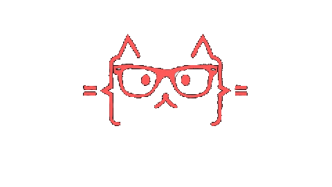

<!--
**D3T3F/D3T3F** is a ✨ _special_ ✨ repository because its `README.md` (this file) appears on your GitHub profile.

Here are some ideas to get you started:

- 🔭 I’m currently working on ...
- 🌱 I’m currently learning ...
- 👯 I’m looking to collaborate on ...
- 🤔 I’m looking for help with ...
- 💬 Ask me about ...
- 📫 How to reach me: ...
- 😄 Pronouns: ...
- ⚡ Fun fact: ...
-->

<h2 align='center'> Hey there! 👋 I am David T.F!</h2>

  

    
    <a>ㅤㅤㅤㅤ</a>
    

<h2></h2>

  

<h2></h2>

### 🧑‍💻 About Me :
I am a Brazilian back-end developer.
- 📖 I’m studying software development in Cotil-Unicamp.

- 🏫 I’m in Twelfth grade.

- ⚡ In my free time, I study new languages and pratice my programing habilities.

<h2></h2>

### 🛠️ Languages and Tools :

  
  
  
  
  
  
  
  
   
  
  
  
  
  
  
  

